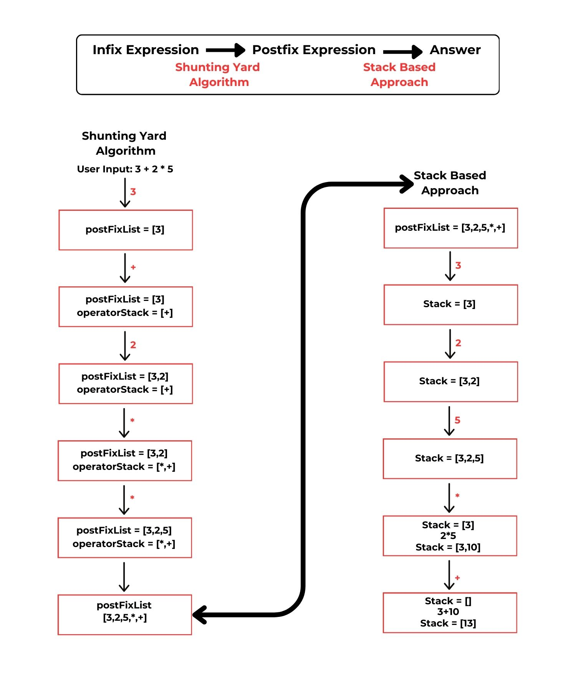

<h1 align="center">🎮Reverse Polish Notation (RPN) Simulator   </h1> 

## 📝 **Project Overview**  
The objective of this project is to **visualize and simulate** the process behind Reverse Polish Notation (RPN). The **Shunting Yard Algorithm** and **Stack-based Approach** are the main Computer Science Theory(CST) that will be given emphasis in the overall outcome of this project. This interactive arcade-inspired simulation provides users with a fun and educational way to explore the concepts behind RPN. 

 

---

## 🏗️ **System Architecture**  

### **Key Components**  

#### **1. Frontend**  
- **Technologies Used**: HTML, CSS, JavaScript  
- **Responsibilities**:  
  - Render the user interface(UI). This includes the arcade-like inspired simulation controls and area.
  - Interactive elements for better user experience(UX).
  - Visualize the process of infix to postfix conversion and then postfix evaluation 

#### **2. Simulation Logic (JavaScript)**  
- **Responsibilities**:  
  - Converting user input(infix expression) into its corresponding postfix expression using shunting yard algorithm.
  - Evaluating the postfix expression using a stack based approach.
  - Provide the complete step by step process for each operation performed in the background.

#### **3. UI/UX Design**  
1. **Arcade Interface**: In order to provide a unique experience to users, RPN simulator mimics an arcade machine to give users the feeling of just playing a game while understanding the concept of Reverse Polish Notation.  
2. **Input Areas**: Special section for user to enter their inputs.
3. **Output Visualization**: Simulation of steps and evaluation are clearly shown
4. **Interactive Controls**: To further add to the overall arcade feels of the RPN simulator, special buttons and token insertion are also added.  

#### **4. Component Interactions**  
- User input data is gathered in the frontend part of the website using the arcade-style Ui. Error handling is also handled to prevent any invalid expressions. JavaScript is the one who processes the input and converts it to its corresponding postfix notation. The added evaluation function will also execute the postfix expression in a step-by-step process. This process will then be shown in the user interface. 

---

## 💡 **Applied Computer Science Concepts**  
### **Reverse Polish Notation (RPN)**  
RPN is a mathematical notation where operators follow their operands, eliminating the need for parentheses to dictate operation order. For example:  
- Infix: `3 + 4` → Postfix: `3 4 +`  

The evaluation process uses a **stack** for efficient computation, making RPN popular in calculators and stack-based programming languages.  

---

## ⚙️ **Algorithms Used**  
1. **Shunting Yard Algorithm**  
   - This is used in converting the user input(infix expression) to its corresponding postfix expression/notation.
2. **Stack-Based Approach**  
   - This is used to evaluate the postfix expression/notation.

---

## 🔒 **Security Mechanisms**  
- Since this project doesn’t really involve user-specific data but only user input expression, the team focused primarily on input validation. Ensuring that user inputs are clean to prevent any unexpected behaviors. This includes checking for empty input, validating allowed characters, detecting consecutive operators, ensuring the expression does not start or end with an operator, verifying balanced parentheses, capturing multi-digit numbers, and handling negative numbers. Proper error handling is also implemented in order to prevent possible crashes that will greatly affect user interactivity.

---

## 🎨 **Development Process and Design Decisions**  
  **Reverse Polish Notation(RPN)** is the main computer science theory that influenced our development decisions. This RPN simplifies expression evaluation and is widely used in stack-based programming languages and calculators for its computational efficiency.  Understanding this concepts influenced our design decisions in the following key points:
1. **Algorithm Choice**  
   - After understanding the process of converting an infix to a postfix expression and then evaluating it after, we were able to determine the algorithms that we need. That algorithm is the shunting yard algorithm and stack-based approach.

2. **System Workflow**  
   - The user interface of this project was designed to be interactive as possible and to reflect the step by step nature of RPN evaluation mirroring how RPN theory emphasized sequential processing  

3. **Educational Approach**  
   - The simulation done inside this project is made with the goal in mind to demonstrate stack behavior, which will then help users understand how the algorithm processes expressions. 

---

## ✅ **Correctness and Efficiency**  

Correctness and Efficiency are critical in the project’s overall success since it deals with algorithmic calculations like RPN.

In order to provide a valid and correct result for Infix to postfix conversion since it is the first part of the whole process, various test cases are used.  This includes expressions with nested parenthesis, operators of different precedence, and invalid input.  For the postfix Evaluation, proper stack behavior and accurate computation for a variety of postfix expressions are also well-observed and verified.

In terms of algorithm and code efficiency, the shunting yard algorithm is used for efficient infix to postfix conversion. By ensuring stack operations are constant time, it minimizes the computational complexity throughout the process. Codes are also written in a way that ensures their readability and efficiency. Avoiding redundant computations, usage of efficient data structures like stacks, and removing unnecessary loops or recursives, which can affect the overall performance of the project. The project is also lightweight in design since it is built entirely client-side, which then avoids server-side latency, ensuring quick processing for user interactions.

---

## 🚀 **How to Run the Project**  

1. 🎲 Get your coin from the coin box.  
2. 🪙 Insert your coin into the coin slot.  
3. ▶️ Press the "Start" button.  
4. 📥 Input your mathematical expression.  
5. ▶️ Press the "Start" button again.  
6. 🔄 Press the "Next" button to progress through each step.  
7. ✅ View the final result and repeat as desired!  

---

## 👨‍💻 **Contributors**  
- **Instructor**: [Ms. Fatima Marie Agdon](https://github.com/marieemoiselle)  
- **Project Manager**: [Reinier Adrian Luna](https://github.com/adnalow)  
- **Frontend Developer**: [Kim Mathew Bautista](https://github.com/KimMathew)  
- **Backend Developers**:  
  - [Gian Ezekiel Gersaniba](https://github.com/GianEzekiel)  
  - [Francois Louise Mosuela](https://github.com/coispers)  

---

## 🙏 **Acknowledgments**  
  The team would like to express their gratitude to God for providing them with the knowledge and strength they needed during this project's development phase. They also wish to thank their instructor for the lessons and advice they received. It made it possible for them to have a clear idea of what they wanted to accomplish when this project was finished.

---
